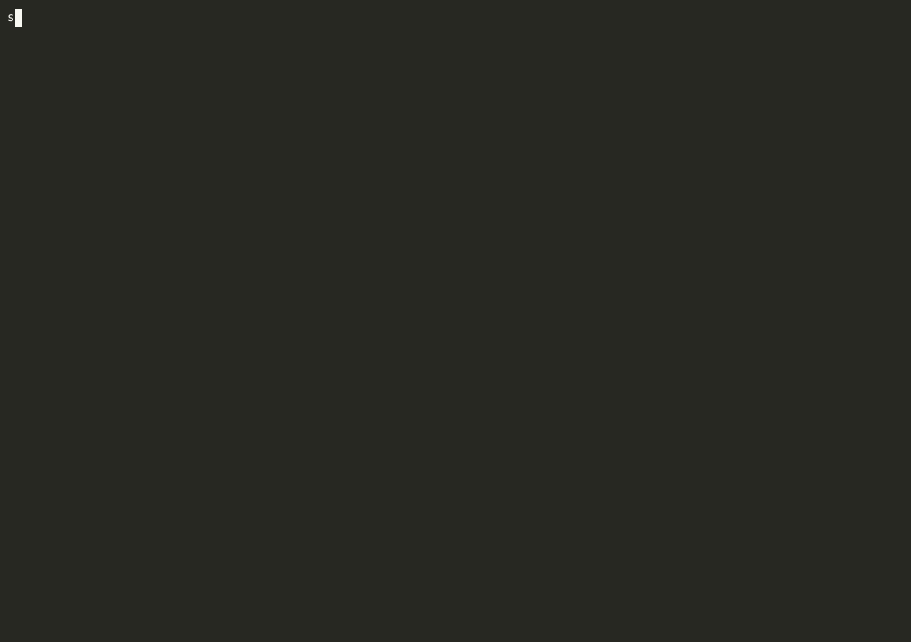

<p align="center">
  
</p>
<p align="center"><strong>AI security agent for developers. Scan, fix, and ship safely.</strong></p>
<p align="center"><a href="https://shipsafecli.com">shipsafecli.com</a> · <a href="https://shipsafecli.com/docs">Docs</a> · <a href="https://shipsafecli.com/blog">Blog</a></p>

<p align="center">
  <a href="https://www.npmjs.com/package/ship-safe"></a>
  <a href="https://www.npmjs.com/package/ship-safe"></a>
  <a href="https://github.com/asamassekou10/ship-safe/actions/workflows/ci.yml"></a>
  <a href="https://opensource.org/licenses/MIT"></a>
  <a href="https://github.com/asamassekou10/ship-safe/stargazers"></a>
  <a href="https://github.com/sponsors/asamassekou10"></a>
</p>

---

<p align="center">
  
</p>

Type `ship-safe` and you're in. 23 agents scan your codebase for secrets, injections, AI/LLM vulnerabilities, supply chain attacks, and 80+ other classes. The agent shows a diff for every proposed fix, asks before writing, and verifies the fix worked. Every change is logged and reversible.

```bash
npx ship-safe
```

---

## Quick Start

```bash
# Interactive REPL — scan, fix, ask questions in one session
npx ship-safe

# Full audit: secrets + 23 agents + deps + remediation plan
npx ship-safe audit .

# Interactive fix agent: plan → diff → accept → verify
npx ship-safe agent .
npx ship-safe agent . --severity critical   # critical findings only
npx ship-safe agent . --branch --pr         # fix on a branch + open a PR

# Undo the last fix
npx ship-safe undo

# CI/CD mode
npx ship-safe ci . --threshold 80 --sarif results.sarif
```

No signup. No API key required for scanning. Works offline.

<p align="center">
  
</p>

---

## 23 Security Agents

All agents run in parallel. Each skips irrelevant projects automatically.

| Agent | Category | What It Detects |
|-------|----------|-----------------|
| **InjectionTester** | Code Vulns | SQL/NoSQL injection, command injection, XSS, path traversal, XXE, ReDoS, prototype pollution |
| **AuthBypassAgent** | Auth | JWT flaws (alg:none, weak secrets), CSRF, OAuth misconfig, BOLA/IDOR, TLS bypass |
| **SSRFProber** | SSRF | User input in fetch/axios, cloud metadata endpoints, internal IPs |
| **SupplyChainAudit** | Supply Chain | Typosquatting, wildcard versions, suspicious install scripts, dependency confusion |
| **ConfigAuditor** | Config | Docker (root user, :latest), Terraform, Kubernetes, CORS, CSP, Firebase, Nginx |
| **SupabaseRLSAgent** | Auth | service_role key in client code, tables without RLS, anon key inserts |
| **LLMRedTeam** | AI/LLM | OWASP LLM Top 10: prompt injection, excessive agency, system prompt leakage |
| **MCPSecurityAgent** | AI/LLM | MCP server misuse, tool poisoning, typosquatting, unvalidated inputs |
| **AgenticSecurityAgent** | AI/LLM | OWASP Agentic AI Top 10: agent hijacking, privilege escalation |
| **RAGSecurityAgent** | AI/LLM | Context injection, document poisoning, vector DB access control |
| **MemoryPoisoningAgent** | AI/LLM | Instruction injection in agent memory files, hidden Unicode payloads (ASI-01, ASI-05) |
| **PIIComplianceAgent** | Compliance | SSNs, credit cards, emails, phone numbers in source code |
| **VibeCodingAgent** | Code Vulns | AI-generated code anti-patterns: no validation, empty catches, TODO-auth |
| **ExceptionHandlerAgent** | Code Vulns | Empty catches, unhandled rejections, leaked stack traces (OWASP A10:2025) |
| **AgentConfigScanner** | AI/LLM | Prompt injection in .cursorrules, CLAUDE.md, malicious Claude Code hooks |
| **MobileScanner** | Mobile | OWASP Mobile Top 10 2024: insecure storage, WebView injection, debug mode |
| **GitHistoryScanner** | Secrets | Leaked secrets in git commit history |
| **CICDScanner** | CI/CD | Pipeline poisoning, unpinned actions, secret logging (OWASP CI/CD Top 10) |
| **APIFuzzer** | API | Routes without auth, mass assignment, GraphQL introspection, debug endpoints |
| **ManagedAgentScanner** | AI/LLM | Claude Managed Agent misconfigs: always_allow policies, unrestricted networking (ASI-03–ASI-07) |
| **HermesSecurityAgent** | AI/LLM | Tool registry poisoning, function-call injection, skill permission drift (ASI-01–ASI-10) |
| **AgentAttestationAgent** | Supply Chain | Unpinned agent versions, missing integrity hashes, unsigned manifests (ASI-10, SLSA L0) |
| **AgenticSupplyChainAgent** | Supply Chain | Over-privileged AI CI actions, OAuth scope creep, unsigned AI webhook receivers (ASI-02, ASI-06) |

**Post-processors:** ScoringEngine · VerifierAgent (secrets liveness) · DeepAnalyzer (LLM taint analysis)

---

## The REPL

```
$ ship-safe

  ███████╗██╗  ██╗██╗██████╗     ███████╗ █████╗ ███████╗███████╗
  ...

  v9.2.1  ·  DeepSeek  ·  ~/my-project

  /scan to find issues  ·  /agent to fix them  ·  /help for more

shipsafe ›
```

| Command | What it does |
|---------|-------------|
| `/scan` | Re-scan the project |
| `/agent` | Run the interactive fix loop |
| `/findings` | List findings from the last scan |
| `/show <n>` | Full detail on finding n |
| `/plan <n>` | Preview fix plan for finding n (no writes) |
| `/undo [--all]` | Revert the last fix (or all fixes) |
| `/diff` | Show git working-tree diff |
| `/provider <name>` | Switch LLM provider mid-session |
| `/quit` | Exit (also `Ctrl-D` or `Ctrl-C`) |

Anything not starting with `/` is sent to the LLM as a free-form question, with your latest scan results as context.

---

## CI/CD

```yaml
# .github/workflows/security.yml
name: Security Audit
on: [push, pull_request]
jobs:
  security:
    runs-on: ubuntu-latest
    steps:
      - uses: actions/checkout@v4
      - name: Security gate
        run: npx ship-safe ci . --threshold 75 --sarif results.sarif
      - uses: github/codeql-action/upload-sarif@v3
        if: always()
        with:
          sarif_file: results.sarif
```

---

## LLM Support

Works with any provider — auto-detected from environment variables. Use `--provider <name>` to override.

Anthropic · OpenAI · Google · DeepSeek · Groq · Together · Mistral · xAI · Perplexity · Ollama · LM Studio · any OpenAI-compatible endpoint

No API key required for scanning. AI is optional.

---

## Suppress False Positives

```python
password = get_password()  # ship-safe-ignore
```

```gitignore
# .ship-safeignore
tests/fixtures/
docs/
```

---

## Add a Badge

```markdown
[](https://shipsafecli.com)
```

---

## Contributing

1. Fork · add your pattern, agent, or config · open a PR
2. See [CONTRIBUTING.md](./CONTRIBUTING.md)

---

## Sponsors

Ship Safe is MIT-licensed and free forever.

<p align="center">
  <a href="https://github.com/sponsors/asamassekou10">
    
  </a>
</p>

---

## Star History

[](https://star-history.com/#asamassekou10/ship-safe&Date)

---

**Ship fast. Ship safe.** — [shipsafecli.com](https://shipsafecli.com)
